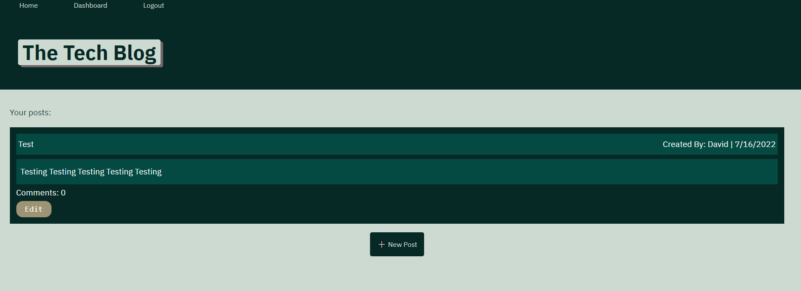

# Tech_Blog_MVC

## Description
Writing about tech can be just as important as making it. Developers spend plenty of time creating new applications and debugging existing codebases, but most developers also spend at least some of their time reading and writing about technical concepts, recent advancements, and new technologies. A simple Google search for any concept covered in this course returns thousands of think pieces and tutorials from developers of all skill levels! This is a CMS-style blog site similar to a Wordpress site, where developers can publish their blog posts and comment on other developers’ posts as well. It follows the MVC paradigm in its architectural structure, using Handlebars.js as the templating language, Sequelize as the ORM, and the express-session npm package for authentication.

## Criteria
* By visiting the site for the first time, you're presented with the homepage, which includes existing blog posts if any have been posted, navigation links for the homepage and the dashboard, and the option to log in
* By clicking on the homepage option, you're taken to the homepage
* By clicking on any other links in the navigation, you're prompted to either sign up or sign in
* By choosing to sign up, you're prompted to create a username and password
* By clicking on the sign-up button, the user credentials are saved and you're logged into the site
* By revisiting the site at a later time and choose to sign in, you're prompted to enter my username and password
* When the user is signed in to the site, they see navigation links for the homepage, the dashboard, and the option to log out
* By clicking on the homepage option in the navigation, you're taken to the homepage and presented with existing blog posts that include the post title and the date created
* By clicking on an existing blog post, you're presented with the post title, contents, post creator’s username, and date created for that post and have the option to leave a comment
* When The user enter a comment and click on the submit button while signed in, the comment is saved and the post is updated to display the comment, the comment creator’s username, and the date created
* By clicking on the dashboard option in the navigation, you're taken to the dashboard and presented with any created blog posts and the option to add a new blog post
* By clicking on the button to add a new blog post, you're prompted to enter both a title and contents for the blog post
* By clicking on the button to create a new blog post, the title and contents of the new post are saved and you're taken back to an updated dashboard with the new blog post
* By clicking on one of the existing posts in the dashboard, you're able to delete or update the post and taken back to an updated dashboard
* By clicking on the logout option in the navigation, you're signed out of the site
* When the user idle on the site for more than a set time, they're able to view comments but they're prompted to log in again before they can add, update, or delete comments

## Installation
* Copy the repository to your system
* Create .env file
  - SET DB_NAME to 'tech_blog'
  - SET DB_USER to 'YOUR-MYSQL-USERNAME'
  - SET DB_PASSWORD to 'YOUR-MYSQL-PASSWORD'
* npm install
* Load schema.sql via MySQL command line:
  - source schema.sql
* npm run seed
* node server.js

## Technologies
* MySQL
* Sequelize
* dotenv
* Handlebars

## Usage
* Create a User
* Login
* Browse Posts
* Add Comments to Posts
* Create, Edit, Delete your own Posts

## Link
* [Heroku Deployed Page](https://tech-blogg-hw.herokuapp.com/)

## Application Preview
